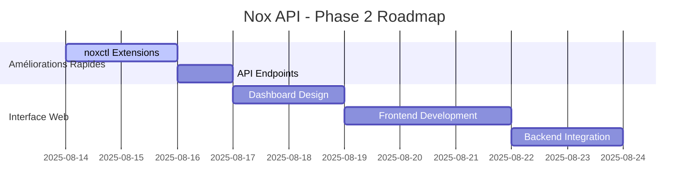

# PLAN DIRECTEUR - PHASE 2
## Nox API - Évolution et améliorations avancées

**Date**: 13 août 2025  
**Status**: PHASE 1 TERMINÉE ✅ - PHASE 2 EN PLANIFICATION

---

## 📋 RÉCAPITULATIF PHASE 1 (TERMINÉE)

### ✅ Étapes 1-7 complètes
- ✅ Installation et configuration de base
- ✅ Maintenance et réparation
- ✅ Durcissement sécurisé
- ✅ Reverse proxy (Caddy/Nginx)
- ✅ Client Python et tests automatiques
- ✅ Journalisation, rotation, et debugging
- ✅ Qualité de vie (noxctl et outils)

### 🏆 État actuel - Production Ready
- API FastAPI sécurisée avec sandbox
- Authentification Bearer token
- HTTPS avec certificats automatiques
- Logs rotatifs et diagnostic complet
- CLI unifiée (noxctl) avec complétion bash
- Tests automatisés et monitoring

---

## 🚀 PHASE 2 - PROPOSITIONS D'AMÉLIORATIONS

### **Étape 8 - Interface Web (Dashboard)**
**Objectif**: Interface graphique pour administration et monitoring

**Fonctionnalités**:
- Dashboard web de monitoring en temps réel
- Interface d'upload de fichiers (drag & drop)
- Éditeur de code intégré avec coloration syntaxique
- Historique des exécutions avec résultats
- Gestion des utilisateurs et permissions
- Métriques et graphiques de performance

**Technologies suggérées**:
- Frontend: Vue.js/React ou Streamlit (Python)
- API extensions: endpoints pour dashboard
- WebSocket: notifications temps réel
- Base de données: SQLite pour historique

**Estimation**: 2-3 jours de développement

---

### **Étape 9 - Multi-utilisateurs et RBAC**
**Objectif**: Support multi-utilisateurs avec contrôle d'accès

**Fonctionnalités**:
- Système d'authentification (JWT + refresh tokens)
- Rôles et permissions granulaires
- Isolation des sandboxes par utilisateur
- Quotas de ressources par utilisateur
- API keys individuelles
- Audit logs des actions utilisateurs

**Sécurité**:
- Sandboxes isolés: `/home/nox/users/{username}/sandbox/`
- Limites CPU/mémoire par utilisateur
- Chiffrement des données sensibles
- Rate limiting par utilisateur

**Estimation**: 3-4 jours de développement

---

### **Étape 10 - Containers et Scalabilité**
**Objectif**: Déploiement containerisé et scaling horizontal

**Fonctionnalités**:
- Docker/Podman containers
- Docker Compose pour déploiement complet
- Load balancer (HAProxy/Nginx)
- Auto-scaling basé sur la charge
- Health checks avancés
- Backup automatisé des données

**Architecture**:
```yaml
services:
  nox-api:
    replicas: 3
    image: nox-api:latest
  redis:
    image: redis:alpine
  postgres:
    image: postgres:15
  nginx:
    image: nginx:alpine
```

**Estimation**: 2-3 jours de développement

---

### **Étape 11 - Extensions et Plugins**
**Objectif**: Système d'extensions pour fonctionnalités personnalisées

**Fonctionnalités**:
- Architecture plugin avec hooks
- Marketplace d'extensions communautaires
- SDK pour développer des plugins
- Support langages supplémentaires (Java, Go, Rust)
- Intégrations externes (Git, CI/CD, Cloud)
- Templates et snippets de code

**Plugins suggérés**:
- Git integration (clone, commit, push)
- Database connectors (MySQL, PostgreSQL, MongoDB)
- Cloud storage (AWS S3, Azure Blob, GCP)
- Notification systems (Slack, Discord, Email)
- Code quality tools (pylint, black, mypy)

**Estimation**: 4-5 jours de développement

---

### **Étape 12 - Performance et Optimisation**
**Objectif**: Optimisation des performances et mise à l'échelle

**Fonctionnalités**:
- Cache Redis pour résultats fréquents
- Exécution asynchrone avec file d'attente (Celery)
- Compression des réponses API
- CDN pour assets statiques
- Base de données pour persistance
- Métriques Prometheus + Grafana

**Optimisations**:
- Pool de processus Python pré-initialisés
- Cache des environnements virtuels
- Pagination des résultats API
- Indexes de recherche full-text
- Optimisation des requêtes SQL

**Estimation**: 3-4 jours de développement

---

## 🛠️ AMÉLIORATIONS IMMÉDIATES (QUICK WINS)

### **A. noxctl - Fonctionnalités avancées**
```bash
# Nouvelles commandes suggérées
noxctl ls                    # Lister fichiers sandbox
noxctl cat <file>           # Afficher contenu fichier
noxctl rm <file>            # Supprimer fichier
noxctl logs                 # Afficher logs API
noxctl status               # Statut détaillé du système
noxctl backup               # Sauvegarder sandbox
noxctl restore <backup>     # Restaurer sandbox
```

### **B. API - Endpoints supplémentaires**
```python
# Nouveaux endpoints suggérés
GET  /api/files            # Lister fichiers sandbox
POST /api/files/search     # Recherche dans fichiers  
GET  /api/stats            # Statistiques d'utilisation
POST /api/admin/users      # Gestion utilisateurs
GET  /api/system/metrics   # Métriques système
POST /api/backup          # Sauvegarde
POST /api/restore         # Restauration
```

### **C. Monitoring avancé**
- Intégration avec Datadog/New Relic
- Alertes proactives (email, SMS)
- Dashboards personnalisables
- Rapports d'utilisation automatiques
- Analyse des tendances

**Estimation**: 1-2 jours par amélioration

---

## 🎯 RECOMMANDATIONS PRIORITAIRES

### **Priorité 1 - Interface Web (Étape 8)**
**Pourquoi**: Amélioration drastique de l'expérience utilisateur
- Dashboard de monitoring visuel
- Interface d'upload intuitive
- Éditeur de code intégré
- Accessible via navigateur web

### **Priorité 2 - Amélioration noxctl (Quick Win A)**
**Pourquoi**: Extension rapide des fonctionnalités existantes
- Réutilise l'architecture existante
- Améliore la productivité immédiatement
- Facile à implémenter (1 jour)

### **Priorité 3 - Multi-utilisateurs (Étape 9)**
**Pourquoi**: Passage à l'échelle d'équipe
- Support plusieurs développeurs
- Isolation et sécurité renforcée
- Préparation pour usage professionnel

---

## 📊 ROADMAP SUGGÉRÉE

### **Court terme (1-2 semaines)**


### **Moyen terme (1 mois)**
- Multi-utilisateurs et RBAC
- Containerisation Docker
- Performance optimizations

### **Long terme (2-3 mois)**
- Système de plugins
- Scalabilité horizontale
- Monitoring avancé avec Grafana

---

## 🚀 ÉTAPE SUIVANTE RECOMMANDÉE

### **Option A: Interface Web Dashboard**
**Description**: Créer une interface web moderne pour Nox API

**Avantages**:
- Expérience utilisateur grandement améliorée
- Accessibilité via navigateur
- Monitoring visuel en temps réel
- Facilite l'adoption par de nouveaux utilisateurs

**Inconvénients**:
- Développement plus complexe
- Nouvelle technologie (frontend)

### **Option B: Extension noxctl (Quick Win)**
**Description**: Ajouter 5-10 nouvelles commandes à noxctl

**Avantages**:
- Très rapide à implémenter (1 jour)
- Réutilise l'existant
- Amélioration immédiate de productivité
- Pas de nouvelle technologie

**Inconvénients**:
- Amélioration incrémentale uniquement

### **Option C: Multi-utilisateurs**
**Description**: Transformer en plateforme multi-utilisateurs

**Avantages**:
- Passage à l'échelle d'équipe
- Modèle commercial possible
- Sécurité renforcée

**Inconvénients**:
- Refactoring significant requis
- Complexité architecture accrue

---

## 💡 MA RECOMMANDATION

Je recommande **l'Option B (Extension noxctl)** comme prochaine étape pour les raisons suivantes:

1. **Momentum**: Capitaliser sur le succès de l'Étape 7
2. **ROI immédiat**: Amélioration de productivité en 1 jour
3. **Risque faible**: Réutilise l'architecture existante éprouvée
4. **Base solide**: Prépare le terrain pour les étapes plus ambitieuses

### **Plan d'implémentation suggéré**:
```bash
# Étape 8-bis: noxctl avancé (1 jour)
noxctl ls, cat, rm, logs, status, backup, restore

# Puis Étape 8: Interface Web (3-4 jours)
Dashboard + monitoring visuel

# Puis Étape 9: Multi-utilisateurs (4-5 jours)
RBAC + sandboxes isolés
```

---

## 🎯 NEXT ACTIONS

**Questions à considérer**:
1. Quel est votre cas d'usage principal? (développement personnel, équipe, production)
2. Préférez-vous les améliorations rapides ou les fonctionnalités majeures?
3. Y a-t-il des besoins spécifiques non couverts?
4. Budget temps disponible pour la suite?

**Je peux implémenter immédiatement**:
- Extension noxctl avec nouvelles commandes
- API endpoints supplémentaires
- Amélioration du monitoring existant
- Dashboard web basique

Quelle direction préférez-vous explorer en premier? 🚀
